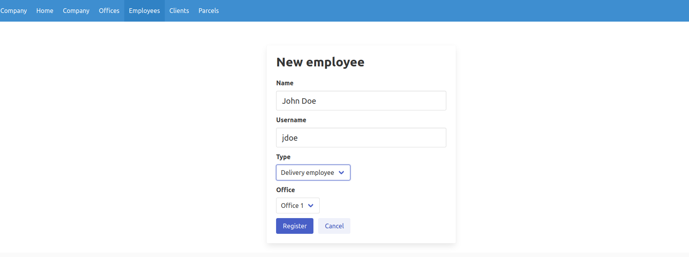
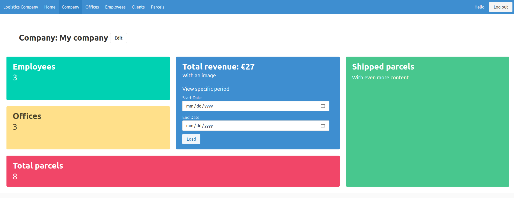
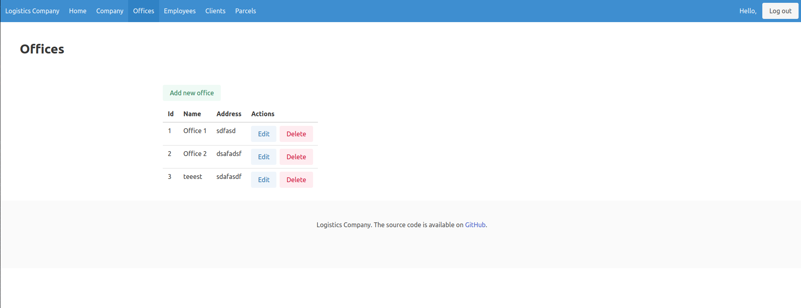
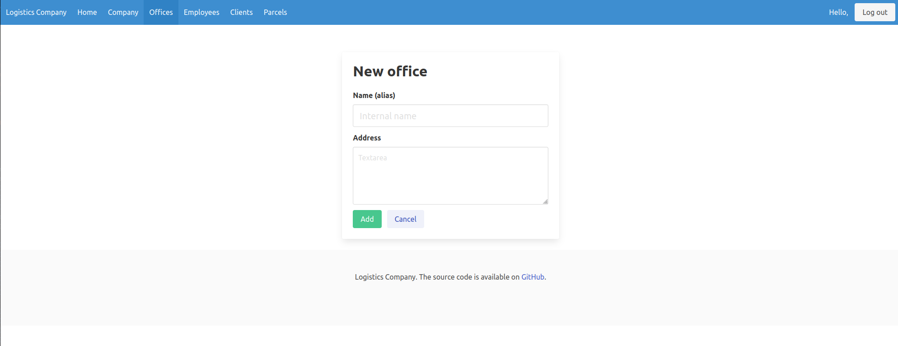
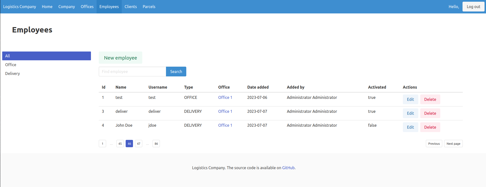
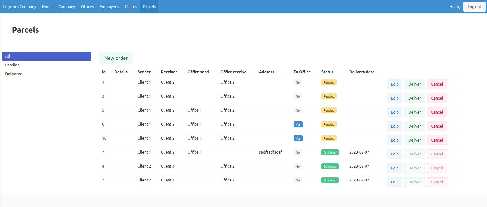
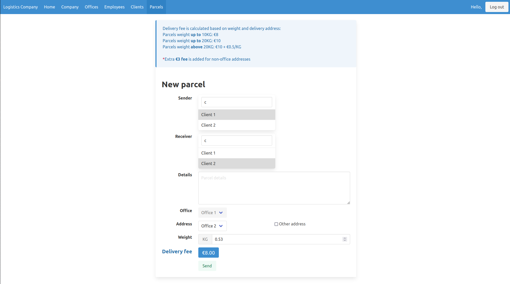

# Logistic company
Web application that tracks the processes of a logistic company.
There are offices of the company, in which employees are working - office employee and delivery employee.
Clients can log in and check their parcels. Office employees send parcels from the office they work at to 
an address, or different company's office.

## Login
One login form for admins, employees and clients.

## Register

## Account activation
Admins can register employees in a specific office.

Employees need to activate their accounts and set a password.

## Company
Company dashboard shows the most important details about the company. Company's revenue for a specific period
can be tracked, as well.

## Offices
List of all company's offices and the ability to register new ones.

## Employees
List of company's employees. They can be  filtered by type (Office or Delivery) from the side menu.

## Parcels
All company's parcels. Can be filtered by status - pending or delivered. Administrators can edit and delete
parcels. Office employees can register new parcels for delivery. Delivery employees can cancel or mark them
as delivered. Delivered parcels add to the company's revenue (via their delivery fee), cancelled ones are
recorded as company loss.

When adding new parcels, office employees can dynamically search for clients for both sender and receiver.
They can choose whether the parcel should be delivered to another office, or to a specific address. This
defines the price as deliveries ot a specific address have higher fees.
